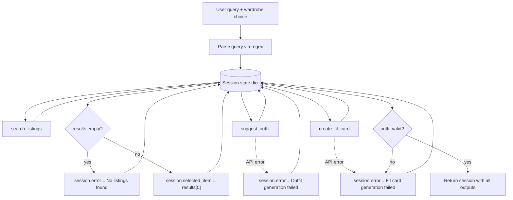

# FitFindr — planning.md

> Complete this document before writing any implementation code.
> Your spec and agent diagram are what you'll use to direct AI tools (Claude, Copilot, etc.) to generate your implementation — the more specific they are, the more useful the generated code will be.
> Your planning.md will be reviewed as part of your submission.
> Update it before starting any stretch features.

---

## Tools

List every tool your agent will use. For each tool, fill in all four fields.
You must have at least 3 tools. The three required tools are listed — add any additional tools below them.

### Tool 1: search_listings

**What it does:**
Searches the 40 mock secondhand listings in `data/listings.json` for items whose title, description, and style tags overlap with the user's keywords. Optionally filters by size and maximum price, then returns matches sorted by relevance (best match first).

**Input parameters:**
- `description` (str): Keywords describing what the user wants (e.g., `"vintage graphic tee"`). Matched case-insensitively against each listing's `title`, `description`, and `style_tags`.
- `size` (str | None): Size to filter by, or `None` to skip. Case-insensitive substring match (e.g., `"M"` matches `"S/M"` or `"M"`).
- `max_price` (float | None): Maximum price inclusive, or `None` to skip. Listings with `price > max_price` are excluded.

**What it returns:**
A `list[dict]` of matching listing dicts, sorted by relevance score (highest first). Each dict contains all fields from the dataset:
`id` (str), `title` (str), `description` (str), `category` (str), `style_tags` (list[str]), `size` (str), `condition` (str), `price` (float), `colors` (list[str]), `brand` (str | None), `platform` (str).

Returns `[]` if no listings pass the filters or score above zero — never raises an exception.

**What happens if it fails or returns nothing:**
The planning loop sets `session["error"]` to a user-facing message (e.g., `"No listings matched your search. Try broadening your keywords, raising your price limit, or removing the size filter."`), leaves `selected_item`, `outfit_suggestion`, and `fit_card` as `None`, and returns the session immediately. `suggest_outfit` and `create_fit_card` are **not** called.

---

### Tool 2: suggest_outfit

**What it does:**
Given a thrifted listing the user is considering and their existing wardrobe, calls the Groq LLM to produce 1–2 outfit suggestions. If the wardrobe has items, the LLM names specific pieces from the wardrobe. If the wardrobe is empty, the LLM gives general styling advice for the new item without referencing owned pieces.

**Input parameters:**
- `new_item` (dict): A single listing dict (typically `session["selected_item"]`) with the same fields as a search result.
- `wardrobe` (dict): A wardrobe object with an `items` key containing a list of wardrobe item dicts. Each item has: `id` (str), `name` (str), `category` (str), `colors` (list[str]), `style_tags` (list[str]), `notes` (str | None).

**What it returns:**
A non-empty `str` containing 1–2 outfit suggestions in plain prose (2–6 sentences). Always returns a string — never raises and never returns `""`.

**What happens if it fails or returns nothing:**
If `wardrobe["items"]` is empty, the tool still succeeds: the LLM prompt switches to general styling mode (e.g., "Pair this with wide-leg jeans and chunky sneakers for a streetwear look") rather than naming wardrobe pieces. If the LLM call fails (network/API error), the agent sets `session["error"]` to `"Couldn't generate outfit suggestions right now. Please try again."`, skips `create_fit_card`, and returns early.

---

### Tool 3: create_fit_card

**What it does:**
Takes the outfit suggestion and the selected listing, then calls the Groq LLM to generate a short, casual social-media caption (Instagram/TikTok style) that mentions the item name, price, and platform once each.

**Input parameters:**
- `outfit` (str): The outfit suggestion string from `suggest_outfit()` (stored in `session["outfit_suggestion"]`).
- `new_item` (dict): The same listing dict passed to `suggest_outfit` (`session["selected_item"]`).

**What it returns:**
A `str` of 2–4 sentences usable as a shareable fit card caption. If `outfit` is empty or whitespace-only, returns an error message string (e.g., `"Can't create a fit card without an outfit suggestion."`) — does not raise an exception.

**What happens if it fails or returns nothing:**
If `outfit` is missing or blank, the tool returns an error string and the agent sets `session["error"]` to that message; `fit_card` is still stored but the UI treats `session["error"]` as the primary output. If the LLM call fails, the agent sets `session["error"]` to `"Couldn't generate your fit card right now. Please try again."` and returns.

---

### Additional Tools (if any)

#### Tool 4: compare_price (stretch)

**What it does:** Compares a listing's price to comparable items in `data/listings.json` (same category or overlapping style tags) and returns a fair/good deal/above typical verdict with numeric reasoning.

**Input parameters:**
- `item` (dict): A listing dict (typically `session["selected_item"]`).

**What it returns:** A `str` price assessment, e.g. *"Fair price — $24.00 vs. $22.00 median among 12 comparable tops listings..."*

**Failure mode:** If no comparables exist, returns an informative string — never raises.

---

#### Tool 5: check_trends (stretch)

**What it does:** Loads mock trend data from `data/trends.json` (simulated Depop/Instagram tag snapshot) and returns trending styles for the user's size bucket.

**Input parameters:**
- `size` (str | None): Size from the parsed query or selected listing.

**What it returns:** A `dict` with `trending_tags` (list[str]), `summary` (str), `source` (str), `size_bucket` (str).

**Failure mode:** Falls back to the default trend bucket if size can't be mapped — never raises.

---

#### Style profile memory (stretch)

**Storage:** `data/style_profile.json` via `utils/style_profile.py` (gitignored). Fields: `preferences` (str), `favorite_tags` (list[str]), `updated_at`.

**When updated:** User types into the Gradio "Style preferences" box, or the agent extracts phrases like *"I mostly wear baggy jeans..."* from a successful query.

**How used:** Loaded at the start of each run and passed into `suggest_outfit()` so later searches don't require re-describing style.

---

#### Retry logic with fallback (stretch)

**Where:** `search_with_retry()` in `agent.py`.

**Logic:** If the initial `search_listings()` returns `[]`, retry without the size filter. If still empty, retry without the price limit too. Store human-readable adjustments in `session["search_adjustments"]` and show them in the UI listing panel.

---

## Planning Loop

**How does your agent decide which tool to call next?**

The agent runs a fixed, sequential pipeline in `run_agent(query, wardrobe)`. Tool order never changes; early exit happens only on search failure or LLM errors.

**Query parsing (before any tool call):**
Extract three fields from the natural-language `query` using regex (documented choice — no LLM needed for parsing):
1. `max_price`: match patterns like `under $30`, `under 30`, `max $30`, `below $30` → `float` (e.g., `30.0`). If no match, `None`.
2. `size`: match patterns like `size M`, `size 8`, `size US 7`, `size S/M` → `str`. If no match, `None`.
3. `description`: the original query with price/size phrases stripped out, trimmed. If empty after stripping, use the full query as-is.

Store as `session["parsed"] = {"description": ..., "size": ..., "max_price": ...}`.

**Step-by-step conditional logic:**

```
1. session = _new_session(query, wardrobe)

2. session["parsed"] = parse_query(query)   # regex extraction

3. session["search_results"], session["search_adjustments"] = search_with_retry(...)

4. IF len(session["search_results"]) == 0:
       session["error"] = "No listings matched your search, even after loosening filters..."
       RETURN session

5. session["selected_item"] = session["search_results"][0]
   session["price_assessment"] = compare_price(selected_item)
   session["trends"] = check_trends(parsed size or listing size)

6. TRY suggest_outfit(..., style_profile=session["style_profile"], trends=session["trends"])
   EXCEPT (API/network error):
       session["error"] = "Couldn't generate outfit suggestions right now. Please try again."
       RETURN session

7. TRY:
       session["fit_card"] = create_fit_card(
           outfit=session["outfit_suggestion"],
           new_item=session["selected_item"],
       )
   EXCEPT (API/network error):
       session["error"] = "Couldn't generate your fit card right now. Please try again."
       RETURN session

8. IF session["fit_card"] starts with "Can't create" (guard-string from create_fit_card):
       session["error"] = session["fit_card"]
       RETURN session

9. RETURN session   # success — error is None, all three outputs populated
```

**Done condition:** The loop is complete when the session is returned — either with `error` set (early exit) or with `selected_item`, `outfit_suggestion`, and `fit_card` all populated and `error` is `None`.

---

## State Management

**How does information from one tool get passed to the next?**

All state lives in a single `session` dict created by `_new_session()`. The planning loop reads and writes fields on this dict; tools themselves are stateless functions that receive inputs and return outputs.

| Session field | Set when | Used by |
|---------------|----------|---------|
| `query` | Initialization | Reference only (original user input) |
| `parsed` | After regex parsing | Passed into `search_listings()` |
| `search_results` | After `search_listings()` | Checked for empty; `[0]` becomes `selected_item` |
| `selected_item` | After search succeeds | Passed to `suggest_outfit()` and `create_fit_card()` |
| `wardrobe` | Initialization (from UI or test) | Passed to `suggest_outfit()` |
| `outfit_suggestion` | After `suggest_outfit()` | Passed to `create_fit_card()` |
| `fit_card` | After `create_fit_card()` | Returned to UI as final caption panel |
| `price_assessment` | After `compare_price()` | Shown in listing panel |
| `trends` | After `check_trends()` | Injected into outfit panel + `suggest_outfit()` prompt |
| `style_profile` | Loaded at init; updated after success | Passed to `suggest_outfit()` |
| `search_adjustments` | After `search_with_retry()` | Shown in listing panel when filters were loosened |
| `error` | On any early exit | Checked first by UI; if set, other outputs may be `None` |

Data flow: `query` → `parsed` → `search_results` → `selected_item` → `outfit_suggestion` → `fit_card`. The wardrobe is loaded once at init and never modified during the session.

---

## Error Handling

For each tool, describe the specific failure mode you're handling and what the agent does in response.

| Tool | Failure mode | Agent response |
|------|-------------|----------------|
| search_listings | No results match the query (empty list returned) | Set `session["error"]` to: `"No listings matched your search. Try broadening your keywords, raising your price limit, or removing the size filter."` Return session immediately. UI shows this message in the listing panel; outfit and fit card panels stay empty. |
| suggest_outfit | Wardrobe is empty (`items` is `[]`) | Not an error — tool switches to general styling advice and returns a normal string. Agent proceeds to `create_fit_card`. |
| suggest_outfit | Groq API call fails (network, rate limit, bad key) | Set `session["error"]` to: `"Couldn't generate outfit suggestions right now. Please try again."` Return session without calling `create_fit_card`. |
| create_fit_card | Outfit input is missing or incomplete (empty/whitespace string) | Tool returns `"Can't create a fit card without an outfit suggestion."` Agent copies this into `session["error"]` and returns. |
| create_fit_card | Groq API call fails | Set `session["error"]` to: `"Couldn't generate your fit card right now. Please try again."` Return session. |

---

## Architecture



**ASCII equivalent:**

```
User query
    │
    ▼
[Parse query] ──► session.parsed
    │
    ▼
[search_listings(description, size, max_price)] ──► session.search_results
    │
    ├── results = [] ──► session.error = "No listings matched..." ──► RETURN
    │
    ▼
session.selected_item = results[0]
    │
    ▼
[suggest_outfit(selected_item, wardrobe)] ──► session.outfit_suggestion
    │
    ├── API error ──► session.error = "Couldn't generate outfit..." ──► RETURN
    │
    ▼
[create_fit_card(outfit_suggestion, selected_item)] ──► session.fit_card
    │
    ├── empty outfit / API error ──► session.error = message ──► RETURN
    │
    ▼
RETURN session (success)
```

---

## AI Tool Plan

**Milestone 3 — Individual tool implementations:**

For each tool in `tools.py`, I will use **Cursor (Claude)** as the AI assistant.

**Tool 1 — `search_listings`:**
- **Input to AI:** Tool 1 block from this file (inputs, return value, failure mode) plus the `load_listings()` docstring from `utils/data_loader.py`.
- **Expected output:** A function that loads listings, filters by `max_price` and `size`, scores by keyword overlap with `description`, drops zero-score results, and sorts descending.
- **Verification:** Run 3 manual tests in a Python REPL before wiring into the agent:
  1. `"vintage graphic tee"`, `max_price=30.0` → should return `lst_006` near the top.
  2. `"90s track jacket"`, `size="M"` → should return `lst_004`.
  3. `"designer ballgown"`, `size="XXS"`, `max_price=5.0` → should return `[]`.
  Check that all three filter parameters are applied and empty results return `[]` without raising.

**Tool 2 — `suggest_outfit`:**
- **Input to AI:** Tool 2 block from this file, the wardrobe schema from `data/wardrobe_schema.json`, and the existing `_get_groq_client()` stub in `tools.py`.
- **Expected output:** A function with two prompt paths (empty wardrobe vs. populated wardrobe) that calls Groq and returns a non-empty string.
- **Verification:** Test with `get_example_wardrobe()` and `lst_006`; confirm response names wardrobe items. Test with `get_empty_wardrobe()`; confirm response gives general advice without referencing owned pieces. Confirm neither path returns `""` or raises.

**Tool 3 — `create_fit_card`:**
- **Input to AI:** Tool 3 block from this file plus the style guidelines in the `create_fit_card` docstring.
- **Expected output:** A function that guards empty outfit input, calls Groq with item details + outfit text, and returns a 2–4 sentence caption.
- **Verification:** Test with a sample outfit string and `lst_006`; confirm caption mentions title, price, and platform. Test with `outfit=""`; confirm it returns the error string without raising.

**Milestone 4 — Planning loop and state management:**

- **Input to AI:** Planning Loop section, State Management section, Architecture diagram, and the `_new_session()` / `run_agent()` stubs in `agent.py`.
- **Expected output:** A completed `run_agent()` that matches the step-by-step conditional logic above, plus a regex `parse_query()` helper.
- **Verification:** Run `python agent.py` and confirm:
  1. Happy path prints a found listing, outfit, and fit card (no error).
  2. No-results path (`"designer ballgown size XXS under $5"`) prints the search error message.
  Compare session field names and flow against the Architecture diagram before moving to `app.py`.

---

## A Complete Interaction (Step by Step)

FitFindr is a secondhand fashion agent that helps users discover pre-owned clothing and style new finds with pieces they already own. A user query triggers `search_listings` first; if matches are found, the agent passes the top result and the user's wardrobe into `suggest_outfit`, then calls `create_fit_card` to generate a shareable caption. If `search_listings` returns nothing, the agent tells the user no items matched and stops — it does not call `suggest_outfit` or `create_fit_card`.

**Example user query:** "I'm looking for a vintage graphic tee under $30. I mostly wear baggy jeans and chunky sneakers. What's out there and how would I style it?"

**Step 1 — Search listings**
- **Tool:** `search_listings`
- **Input:** `description="vintage graphic tee"`, `max_price=30.0` (no size filter — user did not specify one)
- **Why:** The user wants to see what's available before styling advice; search must run first.
- **Output:** Returns matching listings. Top result: **Graphic Tee — 2003 Tour Bootleg Style** (`lst_006`) — $24, Depop, good condition, size L, tags include `vintage`, `graphic tee`, `band tee`.

**Step 2 — Suggest outfit**
- **Tool:** `suggest_outfit`
- **Input:** `new_item=<lst_006 listing dict>`, `wardrobe=get_example_wardrobe()` (includes baggy jeans and chunky white sneakers)
- **Why:** User asked how they'd style the find and mentioned baggy jeans and chunky sneakers — the example wardrobe has matching pieces (`w_001` baggy jeans, `w_007` chunky sneakers).
- **Output:** Styling suggestion, e.g. "Pair this faded bootleg tee with your baggy straight-leg jeans and chunky white sneakers. Tuck the front slightly for a relaxed streetwear silhouette."

**Step 3 — Create fit card**
- **Tool:** `create_fit_card`
- **Input:** `outfit=<styling text from step 2>`, `new_item=<lst_006 listing dict>`
- **Why:** Produces the final social-media-style caption the user can share.
- **Output:** Fit card caption, e.g. "Found: 2003 Tour Bootleg Tee — $24 on Depop. Styled with baggy dark-wash jeans + chunky whites. Vintage grunge, zero effort."

**Final output to user:** A single response with three panels — the matched listing details, the outfit styling advice, and the fit card caption — so the user sees what to buy, how to wear it, and a ready-to-post summary.

**Error path (same query, no matches):** If `search_listings` returned an empty list (e.g. user asked for size XS under $10), the agent would respond with something like "I couldn't find any listings that match your search" and stop. No outfit suggestion or fit card would be generated.
